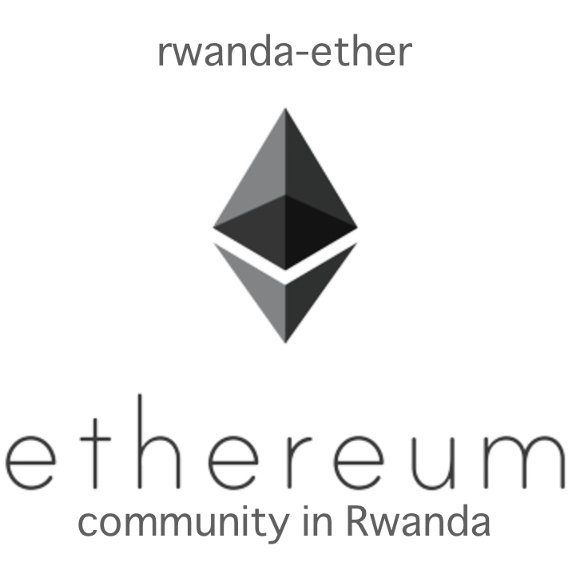
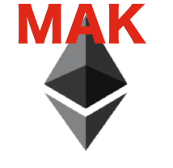

# subcon-20181023

## Requirements

* MAK > 0: MAK holders
* RELV = 0: no RELV holders
* git config user.email "<b><i>your ethereum address</i></b>"

## Term

* Oct-26-2018 ~ Nov-30-2018

## Subcon Model

* LEM: Linear Evolutional Model
* X(n) = C
* V(0) = 5000
* nmax = 100

## Payment

 * MAK
 * RELV: Rwanda-Ether Level +1 (just after your first commit)

## Ethereum Address

* Budget: <a href="https://ropsten.etherscan.io/token/0x7b3c93596c3e07f8afd06a1e7aed3f4fe2ef74b6?a=0xa8ae3962a252c6504b8f9c7d550953cc7a8108af">0xa8ae3962a252c6504b8f9c7d550953cc7a8108af</a>
* MAK: <a href="https://ropsten.etherscan.io/address/0x7b3c93596c3e07f8afd06a1e7aed3f4fe2ef74b6">0x7b3C93596C3e07F8AFd06a1e7aEd3F4fE2EF74B6</a>
* RELV: <a href="https://ropsten.etherscan.io/address/0x773AA7e08C343E13D5993f1DF8F6e1E5AC2dDDF2">0x773AA7e08C343E13D5993f1DF8F6e1E5AC2dDDF2</a>

## Description

Please update the images below. 

*  : update more wity style
*  : update more wity style

